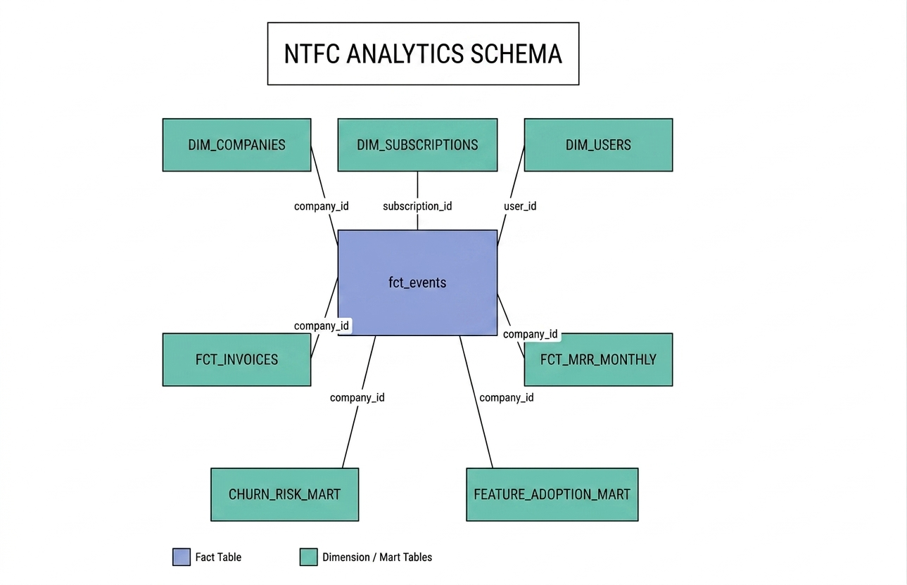
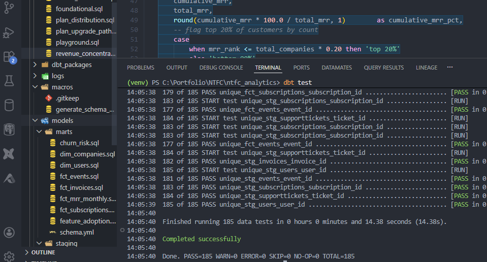
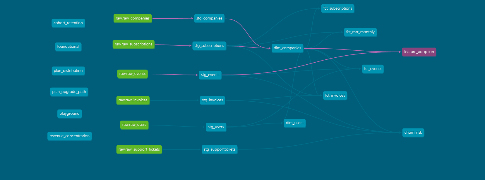
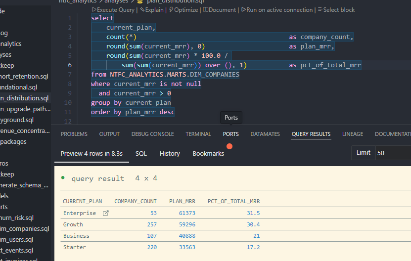
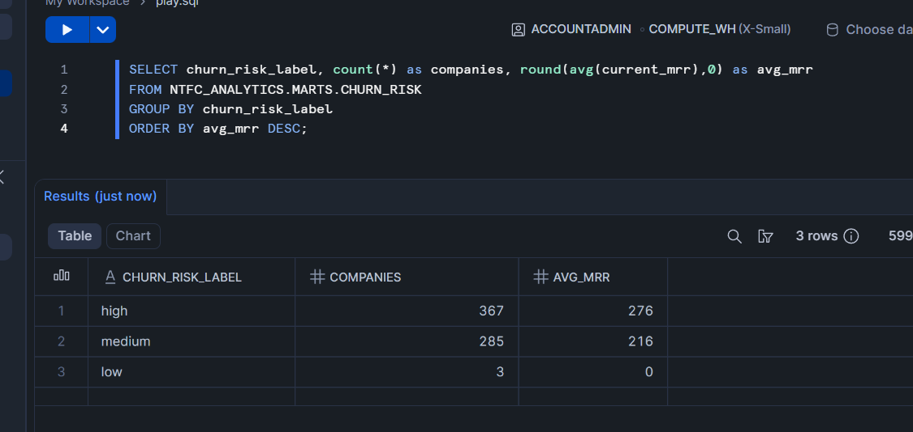
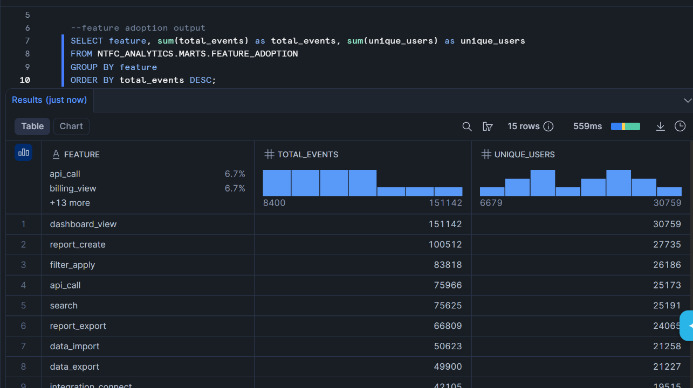
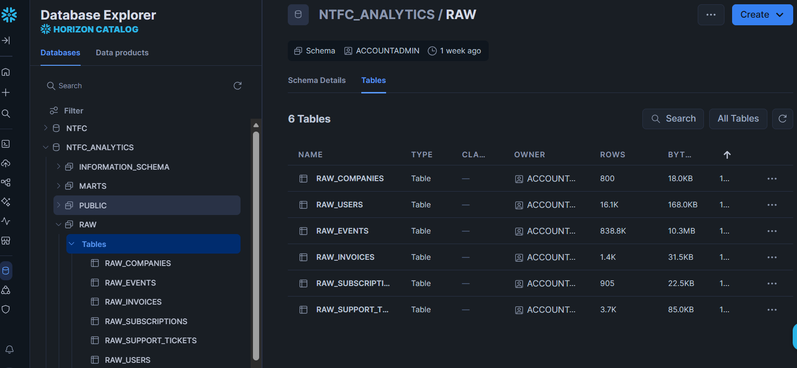
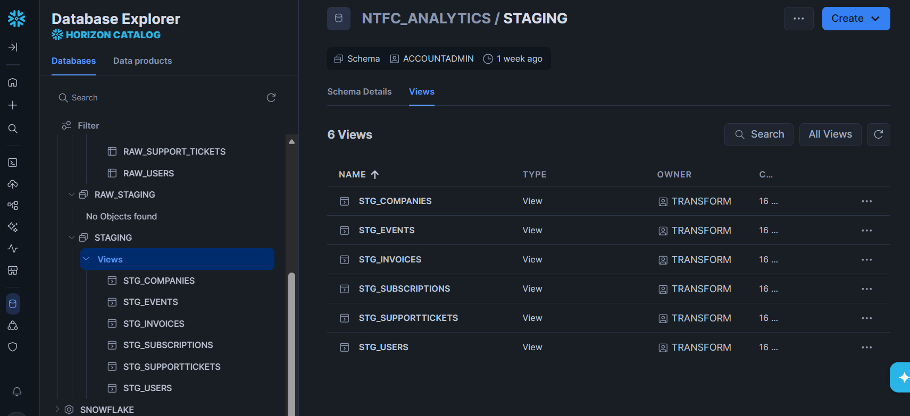
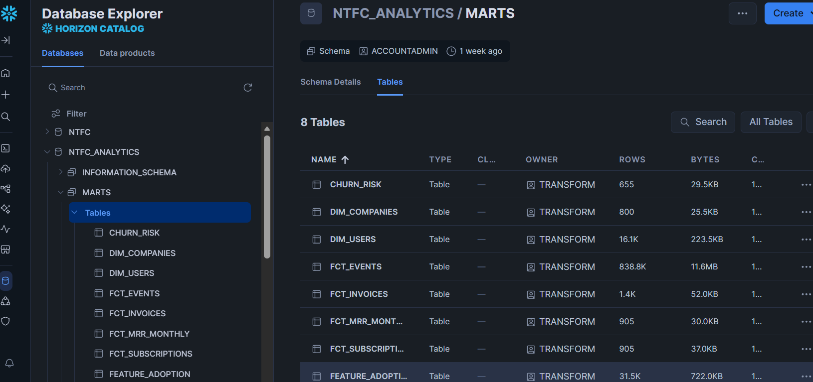

# NTFC Analytics — B2B SaaS Data Platform

End-to-end analytics engineering project built on **dbt + Snowflake** for a B2B SaaS client based in EU. Client details have been anonymised under NDA. The project models raw product, billing, and support data into a clean analytical layer with 14 dbt models, 185 passing data quality tests, and business-ready mart tables covering MRR, churn risk, and feature adoption.

---

## Business Context

NTFC is a B2B SaaS company selling a product analytics platform to European tech companies. The client name and identifying details have been anonymised under NDA. Company names, IDs, and individual identifiers in the dataset have been replaced with generic alphanumeric sequences to protect confidentiality while preserving the structure and business logic of the original data.

The client had three raw data sources — product event logs, subscription billing records, and customer support tickets — but no unified analytical layer. I was brought in as a freelance data analyst to build their first production-grade data pipeline from scratch.

**Core business questions this project answers:**
- Which plan tiers generate the most MRR and which churn fastest?
- Which product features drive retention and which are ignored?
- Which customer segments (industry, country, company size) are most valuable?
- Which companies are at risk of churning based on usage patterns?
- How does payment health correlate with churn signals?
- What percentage of total MRR comes from the top 20% of customers?

---

## Tech Stack

| Tool | Purpose |
|---|---|
| Snowflake | Cloud data warehouse |
| dbt Core | Data transformation and modeling |
| Python | Dataset generation and preparation |
| SQL | Business logic and analysis |
| Git | Version control |

---

## Architecture

### Data Flow

```
Raw CSVs → Snowflake RAW schema → dbt Staging → dbt Marts
```

### Three Layer Design

**RAW** — Six raw tables loaded directly from CSV. All columns stored as STRING to avoid type conflicts on load. No transformations applied.

**STAGING** — Six staging models built as views. Clean and type all columns using TRY_TO_DATE, CAST, and COALESCE. One model per source table. No business logic.

**MARTS** — Eight mart models built as tables. Apply business logic, joins, window functions, and metric calculations. Split into dimension tables, fact tables, and analytical mart tables.

---

## Star Schema



---

## Project Structure

```
ntfc_analytics/
├── analyses/
│   ├── cohort_retention.sql         <- D30/D60/D90 retention by signup cohort
│   ├── revenue_concentration.sql    <- Pareto analysis of MRR distribution
│   └── plan_upgrade_path.sql        <- Most common plan transition sequences
├── models/
│   ├── staging/
│   │   ├── sources.yml
│   │   ├── schema.yml               <- Docs and tests for all staging models
│   │   ├── stg_companies.sql
│   │   ├── stg_subscriptions.sql
│   │   ├── stg_users.sql
│   │   ├── stg_events.sql
│   │   ├── stg_invoices.sql
│   │   └── stg_support_tickets.sql
│   └── marts/
│       ├── schema.yml               <- Docs and tests for all mart models
│       ├── dim_companies.sql
│       ├── dim_users.sql
│       ├── fct_subscriptions.sql
│       ├── fct_events.sql
│       ├── fct_invoices.sql
│       ├── fct_mrr_monthly.sql
│       ├── churn_risk.sql
│       └── feature_adoption.sql
├── screenshots/
├── dbt_project.yml
└── README.md
```

---

## Models

### Staging Layer (views)

| Model | Rows | Description |
|---|---|---|
| stg_companies | 800 | Cleaned company accounts with employee count derived via CASE |
| stg_subscriptions | 905 | Subscription periods with typed dates and decimal MRR |
| stg_users | 16,050 | User seats with boolean flags typed correctly |
| stg_events | 838,790 | Product usage events — largest table |
| stg_invoices | 1,411 | Invoices with multi-format date parsing via COALESCE |
| stg_support_tickets | 3,676 | Support tickets with nullable resolution metrics |

### Marts Layer (tables)

| Model | Description |
|---|---|
| dim_companies | One row per company enriched with current plan, MRR, and ARR |
| dim_users | One row per user with company context and days since last login |
| fct_subscriptions | Revenue table with churn flags, billing cycle flags, and subscription length |
| fct_events | 838k event rows joined with user and company context |
| fct_invoices | Billing records with tax calculations, payment flags, and days to pay |
| fct_mrr_monthly | MRR by month with window functions for plan totals and cumulative growth |
| churn_risk | Churn risk scoring model using four signals: inactivity, payment failure, support burden, and single user dependency |
| feature_adoption | Feature usage aggregated by month, plan, industry, country, and platform |

---

## Data Quality

185 tests across all 14 models covering:

- not_null on all primary and foreign keys
- unique on all primary keys
- accepted_values on all categorical columns (plan names, statuses, platforms, industries)
- relationships tests verifying referential integrity across tables



---

## dbt Lineage



---

## Key Analytical Findings

### Revenue Concentration



The top 20% of customers by MRR generate 59.8% of total revenue — a healthier distribution than the classic Pareto 80/20 benchmark, indicating the client is not dangerously dependent on a small number of enterprise accounts.

Plan-level breakdown shows Enterprise (53 companies) and Growth (257 companies) each contribute approximately 30% of total MRR, suggesting a dual-engine revenue structure where enterprise value and SMB volume balance each other.

### Churn Risk



The churn risk model scores each active company on four signals: days since last product activity, failed or overdue invoices, unresolved support tickets, and single-user dependency. Companies scoring 4 or above are flagged as high risk — the customer success team uses this to prioritise outreach.

### Feature Adoption



dashboard_view and report_create are the highest volume features. API usage is disproportionately high among Enterprise plan customers, suggesting power users drive integration-heavy workflows that increase switching costs and reduce churn likelihood.

---

## Snowflake Schema

### RAW layer


### STAGING layer


### MARTS layer


---

## Dataset

The dataset reflects a real B2B SaaS business operating across European markets in 2025. All personally identifiable information has been removed and company names and IDs have been replaced with anonymised alphanumeric identifiers to comply with client confidentiality requirements. The data structure, business logic, and metric calculations reflect the actual analytical work delivered to the client.

| Table | Rows | Description |
|---|---|---|
| companies | 800 | Anonymised customer accounts |
| subscriptions | 905 | Subscription periods and plan history |
| users | 16,050 | Individual user seats per account |
| events | 838,790 | Product usage events across all features |
| invoices | 1,411 | Billing records and payment history |
| support_tickets | 3,676 | Customer support interactions |

---

## Setup

### Prerequisites
- Snowflake account 
- Python 3.8 or above
- dbt Core with Snowflake adapter

### Installation

```
pip install dbt-snowflake
dbt init ntfc_analytics
```

### Snowflake Setup

Create the database, schemas, roles, and warehouse using the setup script provided. Load the six CSV files into the RAW schema either via the Snowflake UI loader or SnowSQL CLI.

### Run the project

```
dbt debug                                    # verify connection
dbt run                                      # build all models
dbt test                                     # run all 185 tests
dbt docs generate && dbt docs serve          # open lineage documentation
```

---

## Author

**Wasim Sultani** — Business and Data Analyst

[Portfolio](https://fish-bovid-69e.notion.site/Wasim-Sultani-Business-Data-Analytics-Portfolio-2f53bf09407680c79a76c477e6ef0075) · [LinkedIn](https://linkedin.com/in/wasimsultani0530)
